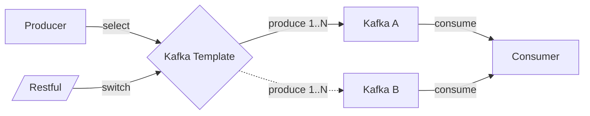

# Kafka Switch-Over

The `kafka-switch-over` project is a Spring Boot application with Gradle, designed to demonstrate a Kafka-based messaging system with dynamic cluster switching. It consists of two modules: `producer` and `consumer`. The producer sends messages to one Kafka cluster at a time and can switch to another cluster via a REST API. The consumer listens to messages from two Kafka clusters simultaneously.

## Project Overview

- **Modules**:
    - **Producer**: Connects to one Kafka cluster at a time, sends messages to the topic `org.b0102.one.event` every second, and supports switching to another cluster via a REST API (`/v1/switch-over`).
    - **Consumer**: Connects to two Kafka clusters concurrently and listens for messages on `org.b0102.one.event` from both.

- **Kafka Clusters**:
    - Two independent Kafka clusters (`kafka1` and `kafka2`), each with its own Zookeeper instance.
    - Each cluster has three topics: `org.b0102.one.event`, `org.b0102.two.event`, and `org.b0102.three.event`.

- **Technologies**:
    - Java 17
    - Spring Boot 3.3.4
    - Gradle
    - Apache Kafka (via Confluent images)
    - Docker Compose

## Architecture

The system is designed to showcase a producer-consumer pattern with Kafka, where the producer can dynamically switch between two Kafka clusters. Below is the architecture diagram:

```plantuml
@startuml C4_Elements
AddRelTag("backup", $textColor="orange", $lineColor="orange", $lineStyle = DashedLine())

System(Producer, "Producer", "Generate messages per second")
System(Consumer, "Consumer", "Resume messages from connected Kafka")

System(KafkaA, "Kafka cluster A", "")
System(KafkaB, "Kafka cluster B", "")

Rel(Producer, KafkaA, "Send messages")
Rel(Producer, KafkaB, "Send messages selectively", $tags="backup")

Rel(KafkaA, Consumer, "Consume messages")
Rel(KafkaB, Consumer, "Consume messages")
@enduml
```

### Components
- **Producer**:
    - Sends a counter-based message (starting from 1) to `org.b0102.one.event` every second.
    - Initially connects to `kafka1:9092` (primary cluster).
    - Uses a REST API (`POST /v1/switch-over`) to switch to `kafka2:9092` (secondary cluster).
    - Configured with Spring Kafka’s `KafkaTemplate`.

- **Consumer**:
    - Listens to `org.b0102.one.event` on both `kafka1:9092` and `kafka2:9092`.
    - Logs received messages to the console for simplicity.
    - Uses Spring Kafka’s `@KafkaListener` with separate consumer factories for each cluster.

- **Kafka Clusters**:
    - `kafka1`: Runs on `kafka1:9092`, backed by `zookeeper1:2181`.
    - `kafka2`: Runs on `kafka2:9092`, backed by `zookeeper2:2182`.
    - Each cluster is pre-configured with the required topics.

- **Docker Compose**:
    - Orchestrates two Kafka clusters, two Zookeeper instances, and the producer and consumer applications.
    - Ensures network connectivity using Docker’s default bridge network.

## Message Flow

The message flow is illustrated below:



1. The producer starts sending messages (e.g., "1", "2", "3", ...) to `org.b0102.one.event` on `kafka1`.
2. The consumer receives these messages from `kafka1` and logs them.
3. When the `/v1/switch-over` endpoint is called, the producer switches to `kafka2`.
4. The producer continues sending messages to `org.b0102.one.event` on `kafka2`.
5. The consumer receives messages from `kafka2` (and continues listening to `kafka1` if any messages are present).

## Prerequisites

- Java 17
- Gradle
- Docker and Docker Compose
- cURL or any HTTP client (e.g., Postman) for testing the API

## Project Structure
  ```text
  kafka-switch-over/
  ├── producer/
  │   ├── src/
  │   ├── build.gradle
  │   └── Dockerfile
  ├── consumer/
  │   ├── src/
  │   ├── build.gradle
  │   └── Dockerfile
  ├── docker-compose.yml
  ├── settings.gradle
  ├── build.gradle
  └── README.md
  ```

## Setup Instructions

1. **Clone the Repository** (if applicable):
   ```bash
   git clone <repository-url>
   cd kafka-switch-over
   ```

2. **Build the Project**:
   ```bash
   ./gradlew clean build
   ```

3. **Start the Services**:
   ```bash
   docker-compose up --build
   ```

    This starts:
   + Two Zookeeper instances (`zookeeper1:2181`, `zookeeper2:2182`)
   + Two Kafka brokers (`kafka1:9092`, `kafka2:9092`)
   + Producer application (`localhost:8080`)
   + Consumer application


4. **Stopping the Services**:
 
   To stop and remove the containers:
   ```bash
   docker-compose down
   ```
 
## Usage
1. **Sending Messages**:

    The producer automatically sends messages to org.b0102.one.event on kafka1:9092 every second. No manual intervention is required to start producing messages.


2. **Switching Kafka Cluster**:

    To switch the producer to the secondary cluster (kafka2:9092), call the REST API:

   ```bash
   curl -X POST http://localhost:8080/v1/switch-over
   ```

   + Response: "Switched to secondary Kafka cluster"
   + Effect: The producer starts sending messages to kafka2:9092.
   + Consumer Logs: You’ll see messages like:

   ```text
   Received : <counter_value> (PRIMARY|SECONDARY)
   ```

## License

The MIT License (MIT)

This project is licensed under the MIT License.
